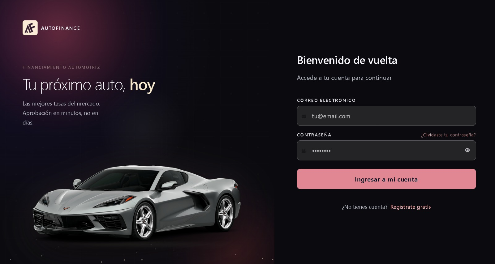
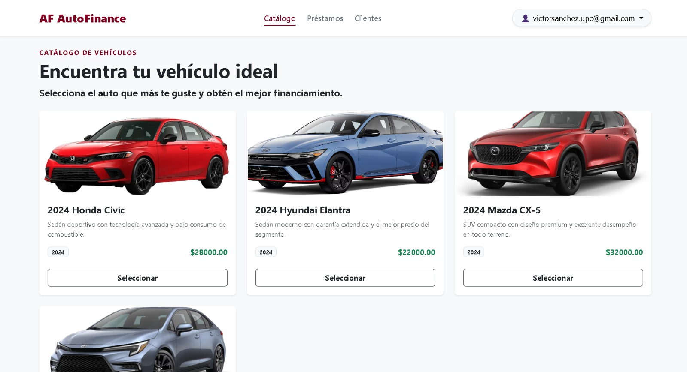
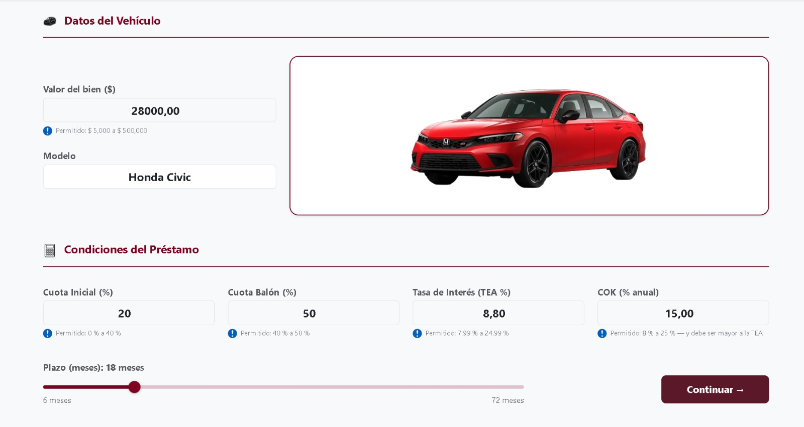
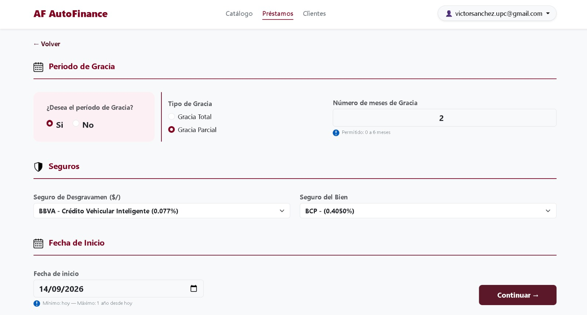
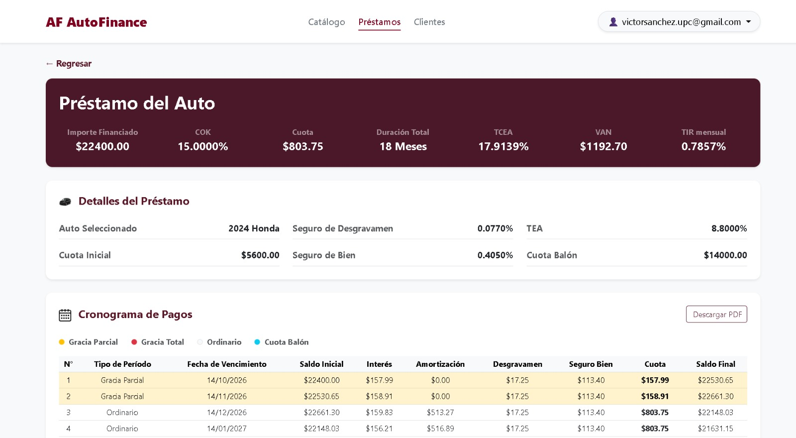
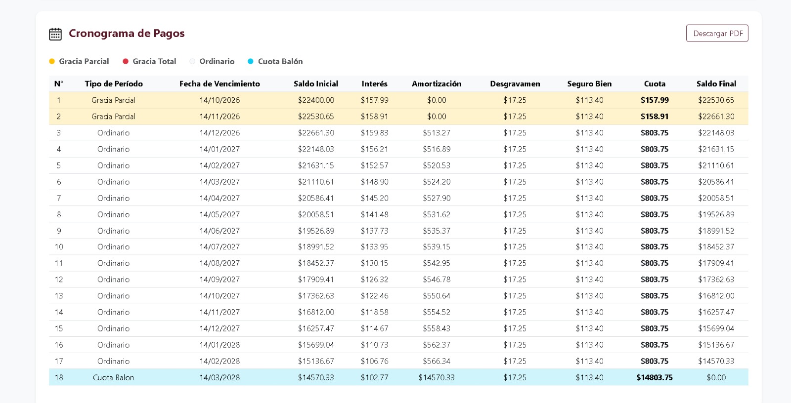

# AutoFinance 🚗

Aplicación web para la simulación de financiamiento vehicular, desarrollada como proyecto académico en la Universidad Peruana de Ciencias Aplicadas (UPC).

AutoFinance permite visualizar vehículos, configurar condiciones de financiamiento y generar automáticamente un cronograma de pagos considerando variables como cuota inicial, TEA, seguros, plazo y otras condiciones asociadas al crédito.

---

## Funcionalidades

- Visualización de catálogo de vehículos.
- Simulación de financiamiento vehicular.
- Configuración de cuota inicial.
- Configuración de TEA y plazo de financiamiento.
- Cálculo de seguro de desgravamen y seguro vehicular.
- Generación automática del cronograma de pagos.
- Cálculo de interés, amortización, cuota y saldo.
- Registro e inicio de sesión de usuarios.
- Persistencia de información en base de datos.
- Servicios REST con autenticación mediante JWT.

---

## Tecnologías

### Backend
- Python
- Django
- Django REST Framework
- JWT

### Base de datos
- PostgreSQL
- SQLite para entorno local

### Frontend
- HTML
- CSS
- JavaScript
- Django Templates

### Infraestructura y despliegue
- Docker
- Gunicorn
- WhiteNoise
- Cloudinary
- Google Cloud Run

---

## Capturas

### Inicio de sesión



### Catálogo de vehículos



### Simulador de financiamiento




### Cronograma de pagos





---

## Mi contribución

Proyecto desarrollado en equipo.

Mis principales aportes fueron:

- Desarrollo de la primera versión funcional de la aplicación web.
- Implementación inicial del catálogo de vehículos y del flujo de simulación.
- Desarrollo de la lógica base para la generación del plan de pagos mediante el sistema francés.
- Implementación inicial de cálculos considerando cuota inicial, TEA, seguros y plazo de financiamiento.
- Definición de la estructura inicial de la aplicación y de sus principales flujos de usuario.

Posteriormente, el equipo continuó refinando la solución con mejoras en autenticación, catálogo y cálculo financiero.

---

## Arquitectura general

La aplicación utiliza Django como framework principal para gestionar la lógica de negocio, vistas y persistencia de información.

El sistema permite procesar los parámetros ingresados por el usuario y generar un cronograma de pagos a partir de las condiciones seleccionadas.

PostgreSQL se utiliza como base de datos principal, mientras que SQLite puede utilizarse para ejecución local y pruebas.

---

## Ejecución local

```bash
git clone https://github.com/VictorZERO21/AutoFinance-Portfolio.git
cd AutoFinance-Portfolio

python -m venv venv
pip install -r requirements.txt

python manage.py migrate
python manage.py runserver
